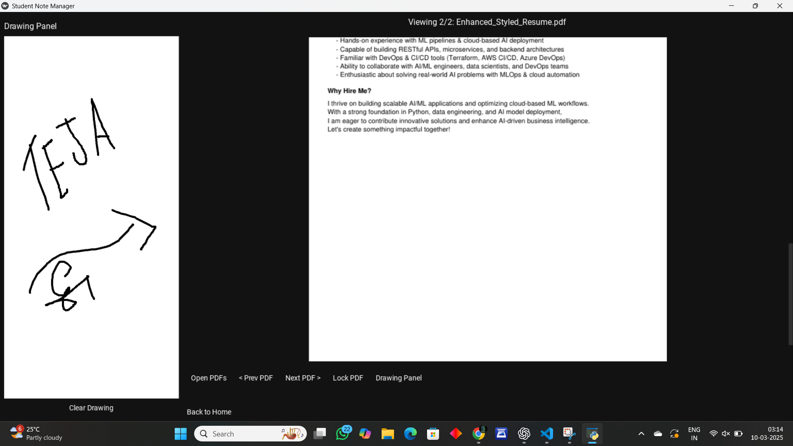

echo "# Student Note Manager

This is a multi-PDF viewer and annotation tool built using **Kivy** and **KivyMD**.

## Demo

## 🚀 Features
- Open multiple PDFs
- View, navigate, and annotatdemo.gife PDFs
- Drag and drop functionality
- 
## 🛠 Requirements
- Python 3.10+
- Kivy, KivyMD
- PyMuPDF (for PDFs)
- Pillow (for images)
